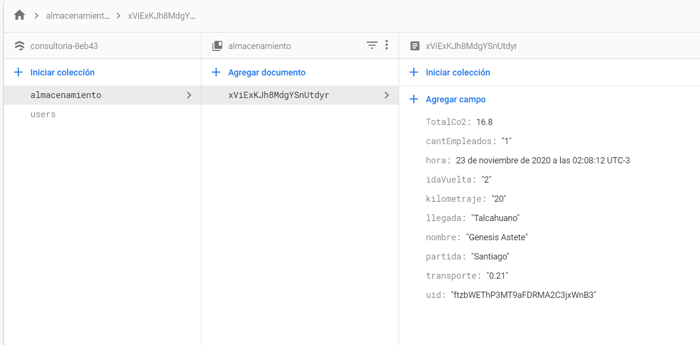
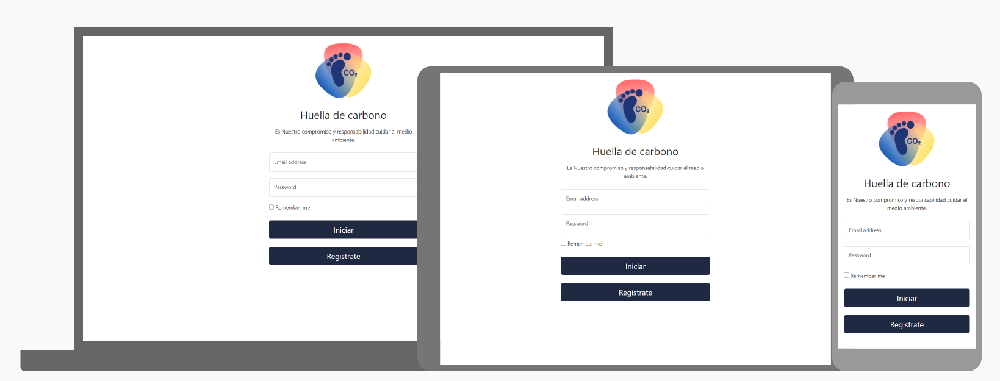

# CO2
***

## Preámbulo :mag:
El principal problema de la emergencia climática a la que nos enfrentamos hoy es generada
por el aumento de temperatura del planeta, lo que desencadena catástrofes como alza en
las mareas, sequías, inundaciones y muchos efectos devastadores. Este aumento de
temperatura se debe al efecto invernadero generado por la acumulación excesiva de CO2
en la atmósfera, que es generado en gran parte por distintas industrias.
Hoy las empresas cada día toman más conciencia en los efectos del medio ambiente, es
por ello, que hacen medición de su huella de carbono, la cual mide el CO2 que genera
cualquier tipo acción, ya sea la producción manufacturera de ropa, la producción de carnes
o incluso el carbono que producen las personas, la huella de carbono se usa para medir el
CO2 generado y principalmente para tratar de disminuir o mitigar el carbono generado.

## Resumen del proyecto :pencil:
Proyecto realizado en Reactjs y Firebase en el cual se realiza un
sitio web que se encarga de registar y almacenar los datos de viajes enviados a traves de la 
plataforma, facilitando asi la contabilización de la huella de carbono producida en cada viaje realizado.
En tanto al diseño de la interfaz de diseño aplique el framework AntDesingn.

## Base de Datos

Se generaron dos colecciones que se encargan de almacenar:

⦁ Users: Informacion del usuario (Email, Fecha de creacion y un IUD unico para la organizacion de la informacion).

⦁ Almacenamiento: Informacion suministrada por los usuarios que guarda para su posterior uso (Nombre, Direccion
de partida y llegada, Tipo de transpporte, Km recorrido, Cant de Empleados, Fecha de creacion(hora) y total de la
Huella recorrida. 

⦁ Interfaz del sitio desplegado:

## Uso

Para instalar, debes ejecutar:

#### `npm install`

#### `npm start`

## Mejoras:

⦁ Agregar variables de entorno para mejorar la seguridad en el sitio.

⦁ Conexion con Google maps API.

⦁ Generar cálculo automático de la distancia entre direcciones.

## Autora
 💻 [Paula Valdez](https://github.com/pmvaldez)
